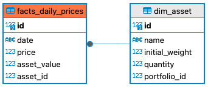
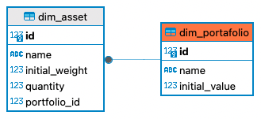

# Proceso de postulación ABAQUS
### Nombre: Daniel Chaparro
## Desafío

[Tarea de desarrollo](https://abaquscl.notion.site/Pregunta-t-cnica-d00b3f926b0845edaec7f198919c83d4#05fc6764f6454751886a5f15b5070323)


## Ejecución


1. Crear ambiente virtual. 
``` abaqus %```
```python -m venv venv```
2. Activar ambiente virtual.
- Windows
```.\venv\Scripts\activate```
- MacOS
```source ./venv/bin/activate```
3. Instalar depencias.
```python -m pip install Django```


#### Levantar aplicación. 
4.  (venv) $ Entrar al proyecto Django : ```cd portfolio```
5.  (venv) $ Instalar depencias del proyecto: ```pip install -r requirements.txt```
6.  (venv) $ Construir BBDD y correr migraciones: ```python manage.py migrate```
7.  (venv) $ Levantar servidor: ```python manage.py runserver```
8.  (venv) $ Poblar BBDD: ```python manage.py run_etl```


#### Credenciales de super usuario.
```
user : daniel
email : daniel@abaqus.cl
pwd : work_hard
```

## Direcciones
Se habilita Django rest framework para facilitar la navegación de la información disponible directamente en el modelo de datos propuesto. 
No se configuró un puerto particular, si no que se utilizó el por defecto de django.

-   "http://127.0.0.1:8000/" = Django rest Api Root framework.
-   "http://127.0.0.1:8000/facts/" = Facts serializer view.
-   "http://127.0.0.1:8000/admin/" = Django Admin.
-   "http://127.0.0.1:8000/portfolio/?fecha_inicio=2023-02-12&fecha_fin=2023-02-12" = Get Portfolio values against "fecha_inicio" & "fecha_fin".
-   "http://127.0.0.1:8000/weights/?fecha_inicio=2023-02-12&fecha_fin=2023-02-12" = Asset weights for each date and portfolio.

### Ejemplos de acceso:

#### Weights
- assets/views.py / AssetWeight / METHOD = 'GET':
```
http://127.0.0.1:8000/weights/?fecha_inicio=2023-02-11&fecha_fin=2023-02-13
```

#### Portfolio Values
- assets/views.py / PortfolioValues / METHOD = 'GET':

```
http://127.0.0.1:8000/portfolio/?fecha_inicio=2023-02-11&fecha_fin=2023-02-13
```

### Bonus 1
- Gráfico "Stacked Area" para "weights" de activos dentro de un portafolio en el tiempo.
```
   http://127.0.0.1:8000/portfolio_time_series
``` 
Gráfico "Stacked Area" para "weights" de activos dentro de un portafolio en el tiempo.
```
   http://127.0.0.1:8000/asset_weights
``` 

## Data Warehouse : Documentación
- Visitar portfolio/assets/models.py

### Dimensiones
#### dim_asset
    - name
    - initial_weight
    - quantity
    - portfolio_id


#### dim_portfolio
    - name
    - initial_value

### Tablas ETL 

#### Raw Daily Prices
    - date
    - asset_id
    - price
    - asset_value
#### Facts Daily Prices
    - date
    - asset_name
    - price
    - asset_value

### Modelo de datos




## SQL

#### Query: Valores diarios para cada uno de los portafolios.
```
SELECT fdp.date , dp.name  , SUM(fdp.weight) total_value 
FROM facts_daily_prices fdp 
JOIN dim_asset da on fdp.asset_id = da.id
JOIN dim_portafolio dp on da.portfolio_id = dp.id
GROUP by fdp.date, dp.name 
```
#### Query: "Weights" diarios de cada activo/portafolio
```
SELECT 
    daily_prices.portfolio_name,
    daily_prices.asset_name,
    daily_prices.date,
    (daily_prices.asset_value / portfolios_values.total_value) AS weight
FROM (
    SELECT 
        fdp.date, 
        fdp.price, 
        da.name AS asset_name, 
        dp.id AS portfolio_id, 
        fdp.asset_value, 
        dp.name AS portfolio_name
    FROM 
        facts_daily_prices fdp 
    JOIN dim_asset da ON fdp.asset_id = da.id
    JOIN dim_portafolio dp ON da.portfolio_id = dp.id
) AS daily_prices
LEFT JOIN (
    SELECT 
        fdp.date, 
        dp.id AS portfolio_id, 
        dp.name, 
        SUM(fdp.asset_value) AS total_value
    FROM 
        facts_daily_prices fdp 
    JOIN dim_asset da ON fdp.asset_id = da.id
    JOIN  dim_portafolio dp ON da.portfolio_id = dp.id
    GROUP BY 
        fdp.date, 
        dp.name, 
        dp.id
) AS portfolios_values
ON 
    daily_prices.portfolio_id = portfolios_values.portfolio_id 
    AND daily_prices.date = portfolios_values.date;
```

### Supuestos

- Se aproximaron los valores obtenidos al tercer decimal.
- Se construyó una tabla facts, simulando el proceso de obtención de precios de activos por portafolio.
- Para Optimizar el proceso de obtención de "weights", se sugiere construir una vista particular, como la segunda query entregada en la parte superior, mediante una migración y el comando RunSQL, para la construcción de la variable "Weights" dependiente de Facts.  Sustituyendo parcialmente el uso del ORM para este caso particular. Y manteniendo actualizados los "weights" frente a cambios en Facts.

## Referencias
- https://realpython.com/get-started-with-django-1/